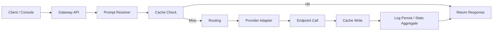

# AetherGate-Lite 全局参考方案

## 1. 项目定位

`AetherGate-Lite` 是一个面向个人用户的轻量多模型网关项目，目标是提供统一的 OpenAI 兼容调用入口、简化的模型接入管理、基础 Prompt 模板能力和可用的调用观测能力。

本项目的默认定位如下：

- 单用户
- 自部署
- 低依赖
- 易维护
- 优先保证最小可用闭环，而非企业级治理完整性

`AetherGate-Lite` 参考现有 `AetherGate` 的能力边界，但不会继承其面向完整网关产品的中间件依赖、企业治理能力和扩展复杂度。新项目按独立项目设计，不按旧系统兼容层实现。

## 2. 执行摘要

### 2.1 为什么选择 Python + FastAPI + SQLite

`AetherGate-Lite` 选择 `Python 3.12 + FastAPI + SQLite` 作为 V1 技术基线，原因如下：

- `Python` 开发效率高，适合个人项目快速迭代、重构和维护。
- `FastAPI` 对 API 网关类项目非常合适，具备较好的类型约束、文档生成能力和异步 HTTP 集成能力。
- `Pydantic v2` 可用于清晰定义请求、响应和配置模型，降低协议转换成本。
- `SQLAlchemy 2.x` 足够支撑 V1 的持久化需求，同时不引入大型 ORM 体系复杂度。
- `SQLite` 能显著降低部署门槛，避免 MySQL、Redis、RabbitMQ 这类外部依赖成为个人使用的维护负担。

该组合的核心优势不是极限性能，而是低成本、低心智负担和较快的功能闭环速度。对于个人用户场景，这是比传统企业后端栈更合理的取舍。

### 2.2 与现有 AetherGate 的关系

`AetherGate-Lite` 的目标不是复制现有项目，而是提炼其中对个人用户仍然有持续价值的能力：

- 保留统一网关入口
- 保留多 endpoint 管理
- 保留基础路由和 fallback
- 保留 Prompt 模板
- 保留基础调用日志和统计

以下复杂度不延续到新项目：

- 多租户和复杂权限体系
- RabbitMQ 驱动的异步观测链路
- Redis 驱动的缓存与熔断体系
- 面向企业治理的限流、配额、死信处理、复杂审计
- 面向多协议长期扩展的重型 Provider 管理

### 2.3 V1 核心原则

V1 的实施原则如下：

- 单体架构
- 单进程运行
- 低依赖
- 优先完成最小可用闭环
- 接口尽量稳定，便于极简控制台直接接入

## 3. 技术栈与工程基线

### 3.1 后端技术栈

- `Python 3.12`
- `FastAPI`
- `Pydantic v2`
- `SQLAlchemy 2.x`
- `httpx`
- `uvicorn`

### 3.2 数据与运行时状态

- 持久化数据库：`SQLite`
- 响应缓存：进程内 `TTL cache`
- 熔断状态：进程内失败计数与冷却窗口
- 日志：本地文件日志

### 3.3 前端与控制台

前端采用“极简控制台”路线，复用现有 React 控制台的产品思路，但不要求沿用旧项目实现细节。控制台职责如下：

- 管理 endpoint
- 查看最近请求日志
- 触发基础连通性验证
- 查看基础指标

### 3.4 工程与运行方式

- 依赖管理：`uv`
- 启动方式：单进程 API 服务
- 配置方式：环境变量 + 本地配置文件
- 部署方式：优先支持本地开发、个人服务器和轻量容器部署

## 4. 系统架构

### 4.1 高层架构图

### 4.2 架构说明

系统采用单进程架构，不引入 `Redis`、`RabbitMQ`、`MySQL`。所有核心能力均围绕单体服务实现：

- 同步主链路负责处理实际模型请求
- 本地数据库负责保存配置和请求日志
- 轻量后台任务仅用于 endpoint 校验或低频维护任务

主链路中必须保持请求路径清晰、可调试、可回溯，避免为了“未来扩展”提前引入多余的中间件。

## 5. 模块划分

### 5.1 Gateway 接口模块

职责：

- 提供 OpenAI 兼容入口
- 统一请求校验
- 分配请求 ID
- 统一响应格式和错误格式

### 5.2 Endpoint 管理模块

职责：

- 管理模型接入点的增删改查
- 启用或禁用 endpoint
- 执行 endpoint 连通性校验
- 为路由模块提供可用候选集合

### 5.3 Provider 适配模块

职责：

- 将统一请求转换为不同 provider 的实际调用格式
- 统一解析 provider 响应
- 屏蔽不同 provider 之间的协议差异

### 5.4 Routing 模块

职责：

- 根据逻辑模型和策略选择实际 endpoint
- 支持 fallback
- 支持基础路由策略

### 5.5 Prompt 模板模块

职责：

- 管理 Prompt 模板
- 渲染模板变量
- 在请求链路中注入或替换 system prompt

### 5.6 Cache 模块

职责：

- 对满足条件的请求进行响应缓存
- 基于消息内容、逻辑模型、策略和温度生成缓存键
- 提供读缓存和写缓存能力

### 5.7 Observability 模块

职责：

- 保存请求日志
- 生成基础聚合指标
- 支撑日志页、今日指标和近 N 天统计

### 5.8 Auth 模块

职责：

- 提供单用户 Bearer Token 鉴权
- 控制对网关与管理接口的访问

## 6. 保留与裁剪清单

### 6.1 V1 保留能力

- OpenAI 兼容接口
- Endpoint CRUD
- 基础路由
- fallback
- Prompt 模板
- 请求日志
- 基础统计
- Bearer 鉴权

### 6.2 V1 保留的 Provider

- `openai_compatible`
- `ollama`

### 6.3 V1 明确裁剪的能力

- 多租户
- MQ 异步链路
- Redis 熔断
- Redis 缓存
- 复杂限流
- 企业治理能力
- 专用 `claude` 适配器
- 专用 `gemini` 适配器

## 7. API 基线

V1 保留以下路径作为系统接口基线。

### 7.1 网关接口

#### `POST /v1/chat/completions`

职责：

- 接收统一对话请求
- 执行 Prompt 渲染、缓存、路由、Provider 调用、fallback 和日志记录
- 返回 OpenAI 兼容响应

输入边界：

- 必须支持 `messages`
- 支持 `model`
- 支持 `temperature`
- 支持 `max_tokens`
- 支持 `prompt_id`
- 支持 `prompt_variables`
- 支持 `strategy`

输出边界：

- 返回 OpenAI 兼容结构
- 返回请求追踪相关响应头
- 返回缓存命中和路由信息的最小可观测结果

#### `GET /v1/models`

职责：

- 返回当前可用逻辑模型列表
- 供控制台和客户端发现模型

### 7.2 内部接口

#### `GET /internal/health`

职责：

- 返回服务健康状态

#### `GET /internal/metrics`

职责：

- 返回今日或当前窗口的聚合指标
- 支撑控制台概览卡片

#### `GET /internal/stats`

职责：

- 返回近 N 天聚合统计
- 支撑控制台趋势图

#### `GET /internal/logs`

职责：

- 返回请求日志列表
- 支撑控制台日志表格和筛选

### 7.3 管理接口

#### `GET/POST/PUT/DELETE /api/endpoints`

职责：

- 管理 endpoint 生命周期
- 被控制台 Endpoint 页面直接依赖

建议扩展接口：

- `POST /api/endpoints/{id}/validate`
- `PUT /api/endpoints/{id}/enabled`

#### `GET/POST/PUT/DELETE /api/prompts`

职责：

- 管理 Prompt 模板
- 被控制台 Prompt 管理页和调用链路共同依赖

建议扩展接口：

- `POST /api/prompts/{id}/preview`

## 8. 数据模型

V1 只保留三张核心表。

### 8.1 `model_endpoints`

职责：

- 保存模型接入点配置
- 作为路由和 provider 调用的配置来源

最小字段范围：

- `id`
- `name`
- `provider_type`
- `base_url`
- `encrypted_key`
- `model_name`
- `logical_model`
- `priority`
- `weight`
- `input_cost_per_1k`
- `output_cost_per_1k`
- `quality_score`
- `is_enabled`
- `is_valid`
- `last_validated_at`
- `remark`
- `created_at`
- `updated_at`

### 8.2 `prompt_templates`

职责：

- 保存 Prompt 模板及变量定义
- 为请求主链路提供模板渲染能力

最小字段范围：

- `id`
- `prompt_id`
- `name`
- `description`
- `content`
- `variables`
- `use_count`
- `is_active`
- `created_at`
- `updated_at`

### 8.3 `request_logs`

职责：

- 保存每次模型调用的关键信息
- 作为日志查询与统计聚合的数据来源

最小字段范围：

- `id`
- `request_id`
- `endpoint_id`
- `logical_model`
- `provider`
- `actual_model`
- `prompt_tokens`
- `completion_tokens`
- `total_tokens`
- `cost_usd`
- `latency_ms`
- `cache_hit`
- `route_reason`
- `status`
- `error_code`
- `prompt_id`
- `fallback_count`
- `timestamp`
- `created_at`

### 8.4 V1 不建立的数据表

- `daily_stats`
- `mq_dead_letter_log`
- `user_access_token`

`metrics` 和 `stats` 直接由 `request_logs` 聚合生成，不为 V1 单独设计额外统计表。

## 9. 运行规则

### 9.1 缓存规则

- 仅对低温度请求生效
- 缓存键由消息内容、逻辑模型、路由策略、Prompt 标识和温度共同决定
- 高随机性请求默认不缓存

### 9.2 路由与 fallback 规则

- 优先按逻辑模型筛选候选 endpoint
- 路由策略支持 `designated`、`balanced`、`cheapest`、`quality`
- 主 endpoint 调用失败时按候选顺序 fallback
- fallback 行为必须记录到请求日志

### 9.3 指标与日志规则

- `metrics` 与 `stats` 直接从 `SQLite` 聚合
- 请求成功、失败、fallback、缓存命中均需记录
- 不引入消息队列解耦日志链路

### 9.4 Endpoint 校验规则

- Endpoint 校验支持同步执行
- 如需后台执行，只允许使用轻量后台任务
- 校验结果更新 `is_valid` 和 `last_validated_at`

### 9.5 密钥处理规则

- API Key 使用环境变量提供的主密钥进行本地加密
- 数据库中不保存明文 Key
- 控制台只能展示脱敏结果

## 10. 开发阶段规划

### Phase 1：基础骨架

- 初始化 Python 项目
- 定义目录结构
- 建立配置体系
- 定义数据库模型
- 搭建基础 API 壳

### Phase 2：主链路闭环

- 打通 `/v1/chat/completions`
- 实现 `openai_compatible` Provider
- 实现统一请求与响应模型
- 接入缓存、路由、fallback 和日志记录

### Phase 3：配置能力

- 接入 `ollama` Provider
- 实现 Prompt 模板模块
- 实现 Endpoint 管理模块
- 实现 endpoint 校验

### Phase 4：观测与控制台

- 实现 `/internal/logs`
- 实现 `/internal/metrics`
- 实现 `/internal/stats`
- 完成极简控制台对接

### Phase 5：收尾与交付

- 补齐测试
- 补齐部署说明
- 补齐配置示例
- 收敛 API 与文档基线

## 11. 风险与边界

### 11.1 技术路线风险

`Python` 方案的主要优势是实现快、维护轻，但其取舍也很明确：

- V1 不以极限并发性能为目标
- 复杂高并发治理不纳入初始范围
- 单进程内状态在进程重启后会丢失

### 11.2 功能边界

以下内容默认不属于 V1 范围：

- 流式输出
- 多用户体系
- 复杂 RBAC
- 配额系统
- 高级限流
- 多节点分布式部署一致性
- 消息队列驱动的异步处理链路

## 12. 验收标准

以下结果满足时，可认为 `AetherGate-Lite` V1 达到可用状态：

- 新机器仅安装 Python 即可启动服务
- 无 `MySQL`、`Redis`、`RabbitMQ` 仍能完整运行
- 控制台可完成 endpoint 管理、基础调用、日志查看
- `openai_compatible` 与 `ollama` 两类 endpoint 可成功调用
- 开发者仅依据本文档即可开始搭建项目骨架和核心链路

## 13. 最小闭环说明

`AetherGate-Lite` 的最小闭环定义如下：

1. 通过管理接口创建可用 endpoint
2. 通过管理接口创建 Prompt 模板
3. 通过 `/v1/chat/completions` 发起请求
4. 系统完成 Prompt 渲染、路由、Provider 调用和日志记录
5. 控制台通过 `/internal/logs`、`/internal/metrics`、`/internal/stats` 展示结果

只要该闭环可以稳定工作，V1 就具备继续演进的基础。

## 14. 默认决策

以下内容在未特别说明时视为项目默认决策：

- 单用户
- 中文文档
- V1 不做流式输出
- V1 不做复杂权限系统
- V1 不做异步消息队列

